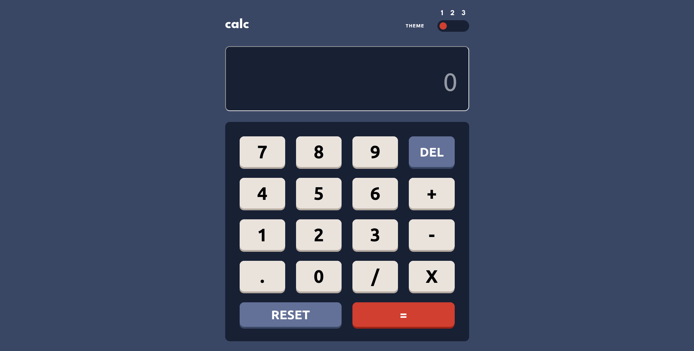
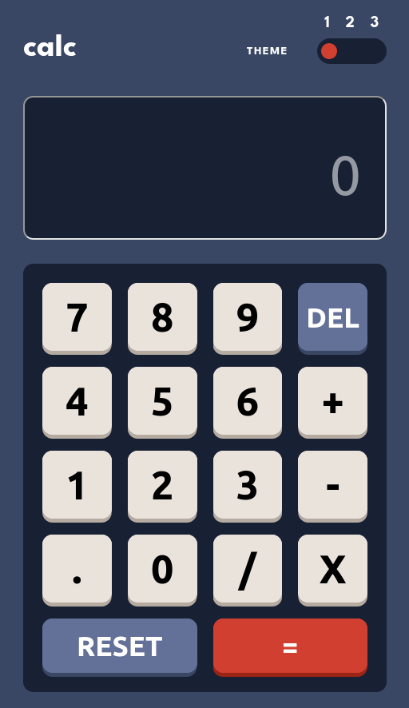

# Frontend Mentor - Basic Calculator Application

This is a solution to the [Basic Calculator Application challenge on Frontend Mentor](https://www.frontendmentor.io/challenges/calculator-app-9lteq5N29)

## Table of contents

- [Overview](#overview)
  - [The challenge](#the-challenge)
  - [Screenshot](#screenshot)
  - [Links](#links)
- [Author](#author)
- [Acknowledgments](#acknowledgments)

## Overview

### The challenge

Users should be able to:

- See the size of the elements adjust based on their device's screen size
- Perform mathmatical operations like addition, subtraction, multiplication, and division
- Adjust the color theme based on their preference

### Screenshot
- Desktop Preview \

- Mobile Preview \

## Author
- Github - (https://github.com/Biggboss7/)
